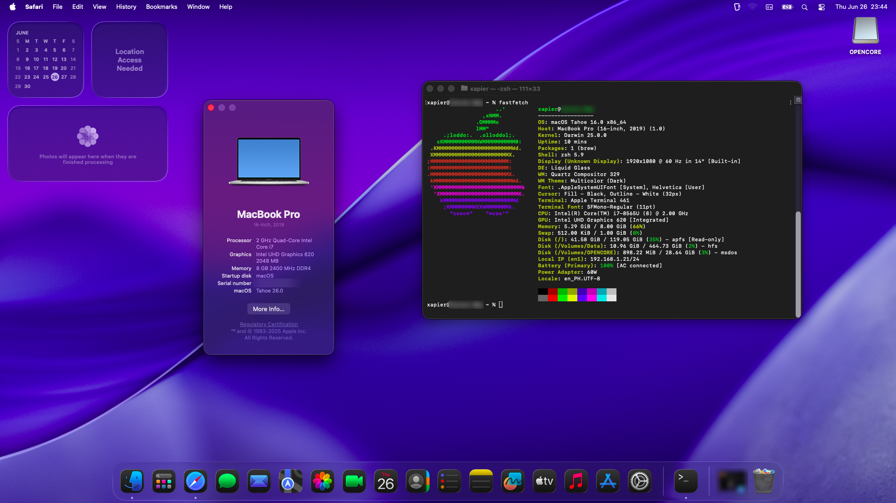

# OpenCore 1.0.5 - macOS 26 (Tahoe Beta 2)

> Note: Also tested to be working on macOS 15 (Sequoia) and 14 (Sonoma)

OpenCore configuration for booting on an HP Pavilion 14 laptop.
Still in progress, but you should be able to boot and install.

Has been stable so far. I've been using this as an iOS simulator device (both on Sequoia and Tahoe) with no issues. On Tahoe, I've ran into some library errors with Python which is to be expected as support and adoption is not there yet.

Note: SSDT files are built for my system, thus it may not work for other systems/configurations.

## Device Info

- Model: HP Pavilion 14 - ce2003nx
- CPU: Intel i7 8565u
- iGPU: Intel UHD 620
- dGPU: Nvidia MX250 (disabled)
- RAM: 8 GB DDR4
- SSD: LITEON CV8-8E128-HP
- Audio: Realtek ALC295
- Ethernet: Realtek RTL8111

## BIOS Settings

- CSM: Disabled
- Intel SGX: Disabled
- Secure Boot: Disabled (Can be enabled if you sign OpenCore correctly)
- SATA Devices: AHCI mode

## Getting Started

1. Clone the repository.
1. Fill up `config.plist > PlatformInfo` using `MacBookPro16,1`.
1. Obtain a copy of the Sequoia recovery (Google is free).
1. Wait for the boot to finish.
1. Install the OS.
1. Boot into `macOS Installer` until it is done.
   1. If you encounter a boot loop, try setting `SecureBootModel` to `Disabled`.
   1. After finishing the install, you can set it back to `Default`.
1. Boot into the OS.
1. Make sure everything is working.
1. Obtain a copy of the Tahoe Beta 2 upgrade installer (again, Google is free).
1. Run the upgrade file.
1. Install the Tahoe beta.

## What's working

- Wifi (via Heliport)
- Ethernet
- iGPU Acceleration
- Brightness
- USB
- Audio (Requires [OCLP-Mod](https://github.com/laobamac/OCLP-Mod) to add back AppleHDA post-install on Tahoe)
- Microphone
- Sleep (a bit buggy)
- Siri
- XCode & iOS Simulator
- OpenCore Canopy (GUI Boot Picker) +Boot Chime
- Touchpad Gestures
- Battery (w/ readout)

## What's not working

- Bluetooth
- Webcam (Black Screen)
- Apple Intelligence (lol)

## Untested

- iMessage
